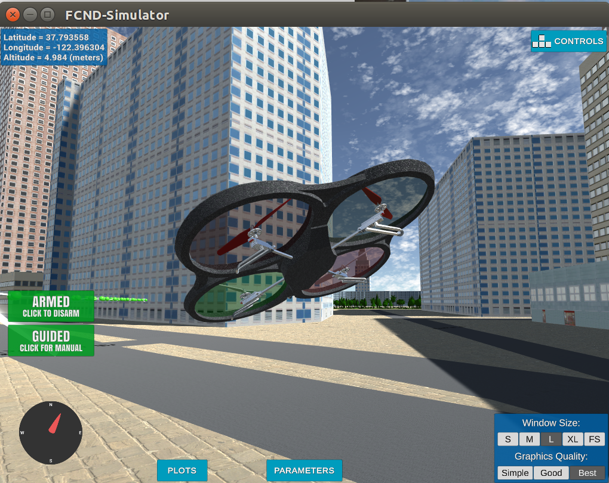
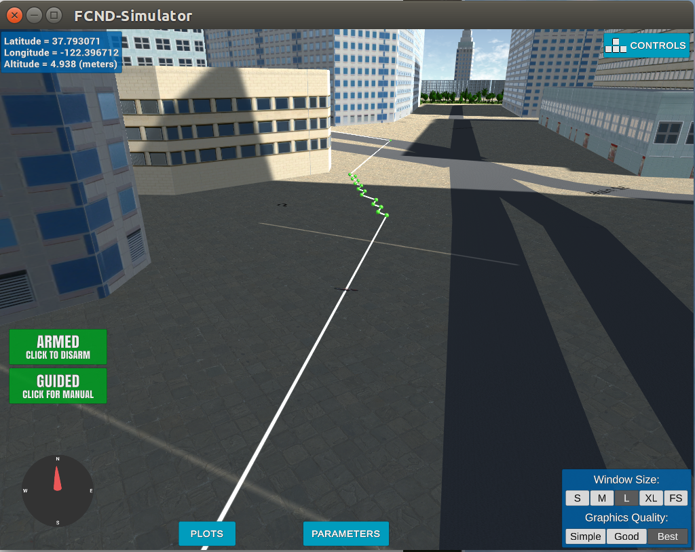

## Project: 3D Motion Planning
### Marko Sarkanj


---


### Writeup / README

This writeup contains the description of implementation of the 3D Motion Planning project. This project has been completed as part of the Self Flying Car Nanodegree program from Udacity.

### Explanation of the Starter Code

#### 1. Explanation of the `motion_planning.py` script
`motion_planning.py` script is advanced version of the `backyard_flyer_solution.py` script. That can be seen by drone behaving the same way in the simulator while running both scripts in their basic implementation. Drone moves from one waypoint to another in square on the map.

The first difference between the scripts is that the script `motion_planning.py` contains one additional state "PLANNING", and all the states are automatically enumerated with `auto()`. This additional state is necessary to calculate waypoints required to reach the desired goal on the map. The `backyard_flyer_solution.py` script does not require the planning step as the only functionality it provides is drone moving in simple square, without the path planning to the goal.

`motion_planning.py` states are listed bellow:
```python
class States(Enum):
    MANUAL = auto()
    ARMING = auto()
    TAKEOFF = auto()
    WAYPOINT = auto()
    LANDING = auto()
    DISARMING = auto()
    PLANNING = auto()

```

The second significant difference is the `path_plan()` function that the `motion_planning.py` script contains. This function gets executed before the `waypoint_transition()` step to calculate waypoints that are required to reach the goal. In the `path_plan()` function all the required positions are defined(home, current position, start and goal) and transferred from global coordinate system(latitude and longitude) to local coordinate system as needed. In the `path_plan()` function obstacle data is loaded, planning grid is created and the A* algorithm is executed. After executing the A* algorithm resulting waypoints are sent for processing.

#### 2. Explanation of the `planning_utils.py` script
`planning_utils.py` script contains `create_grid()` function that, as previously described, creates a planning grid based on obstacle data as 2.5D map, safety distance and drone altitude.

Another part of the `planning_utils.py` script is the `Action` class, which contains all the allowed moves on the planning grid as well as the costs related to them. `valid_actions()` function removes all the actions from the `Action` class that cannot be executed from the specific position on a planning grid because of obstacles for example.

The main part of the `planning_utils.py` script is the `a_star()` function that executes the A* algorithm on the previously created planning grid, start and goal locations. This function uses the `heuristic()` function as well, to assign a cost to A* queue based on its current distance to the goal, in addition to branch cost. 

### Implementation of the Path Planning Algorithm

#### 1. Setting global home position
The global home position is read in the `motion_planning.py` script from the `colliders.csv` file as follows:
```python
lat_lon_data = np.loadtxt('colliders.csv', usecols=(0, 1), delimiter=',', dtype='str')

# read lat0, lon0 from colliders into floating point values
lat0 = float(lat_lon_data[0,0][5:])
lon0 = float(lat_lon_data[0,1][5:])

# set home position to (lon0, lat0, 0)
self.set_home_position(lon0, lat0, 0)
```
After reading of the home position, it can be set with the help of the `set_home_position()` function inherited from the `Drone` class.

#### 2. Setting current local position
Current local position has been converted to local from the `self.global_position` provided by the `Drone` class:
```python
# retrieve current global position
current_global_position = self.global_position

# convert to current local position using global_to_local()
current_local_position = global_to_local(current_global_position, self.global_home)
```

#### 3. Setting grid start position from local position
With extracted `current_local_position` grid start position can be set to current location by subtracting north and east offsets received from the `create_grid()` function together with grid. It is necessary to convert `current_local_position` coordinates to integer so that they can be used as parameters for the A* algorithm.

```python
# convert start position to current position rather than map center
grid_start = (int(current_local_position[0])-north_offset, int(current_local_position[1])-east_offset)
```

#### 4. Setting grid goal position from geodetic coords
To add additional flexibility to the implementation, global longitude and latitude goal coordinates have been converted to local goal coordinates. Afterwards they were converted to grid goal position coordinates by converting them to integer and adding offsets, so that they can be used by the A* algorithm(same procedure as for local position):
```python
# set goal as latitude / longitude position and convert
lon_goal = -122.3961
lat_goal = 37.7940

goal_global = np.array([lon_goal, lat_goal, 0])
goal_local = global_to_local(goal_global, self.global_home)
grid_goal = (int(goal_local[0])-north_offset, int(goal_local[1])-east_offset)

```

#### 5. Modifying A* to include diagonal motion
The `Action` class has been extended in the `planning_utils.py` script to support the diagonal motions. This has been done by adding new actions as follows:
```python
# diagonal motions
NORTH_EAST = (-1, 1, math.sqrt(2))
EAST_SOUTH = (1, 1, math.sqrt(2))
SOUTH_WEST = (1, -1, math.sqrt(2))
WEST_NORTH = (-1, -1, math.sqrt(2))
```
Diagonal motions have slightly higher cost of sqrt(2). 

Additional checks have been added to the `valid_actions()` function as well, to check for not allowed diagonal moves:
```python
    if x - 1 < 0 or y + 1 > m or grid[x - 1, y + 1] == 1:
        valid_actions.remove(Action.NORTH_EAST)
    if x - 1 < 0 or y - 1 < 0 or grid[x - 1, y - 1] == 1:
        valid_actions.remove(Action.WEST_NORTH)
    if x + 1 > n or y + 1 > m or grid[x + 1, y + 1] == 1:
        valid_actions.remove(Action.EAST_SOUTH)
    if x + 1 > n or y - 1 < 0 or grid[x + 1, y - 1] == 1:
        valid_actions.remove(Action.SOUTH_WEST)
```

#### 6. Culling waypoints 
Path has been pruned by removing unnecessary waypoints that find themselves between two waypoints and do not add any new information to a path.

This has been achieved in `planning_utils.py` script by first creating `collinearity_check()` function. This function checks if the three neighbouring points are on the same path and the middle point is unnecessary:
```python
def collinearity_check(p1, p2, p3, epsilon=1e-6):   
    m = np.concatenate((p1, p2, p3), 0)
    det = np.linalg.det(m)
    return abs(det) < epsilon
```

`collinearity_check()` function has been applied in the `prune_path()` function to loop through all waypoints in a path and remove unnecessary waypoints:
```python
def prune_path(path):
    pruned_path = [p for p in path]
    i = 0
    while i < len(pruned_path) - 2:
        p1 = point(pruned_path[i])
        p2 = point(pruned_path[i+1])
        p3 = point(pruned_path[i+2])       
        if collinearity_check(p1, p2, p3):
            pruned_path.remove(pruned_path[i+1])
        else:
            i += 1
            
    return pruned_path
```

This function has been called in the `path_plan()` function of the `motion_planning.py` script on the line 163, to prune the path returned from the A* algorithm:
```python
# prune path to minimize number of waypoints
pruned_path = prune_path(path)
```
### Execute the flight
#### 1. Working implementation
The implementation worked as expected and the drone was able to follow path to the goal defined as longitude and latitude.




